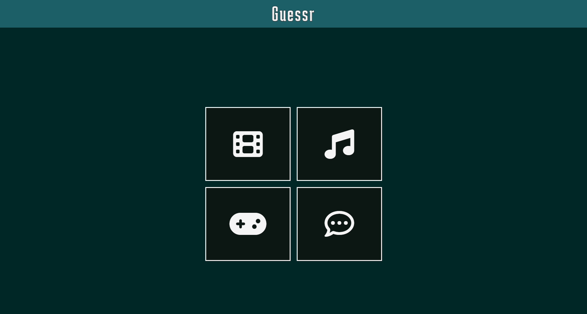
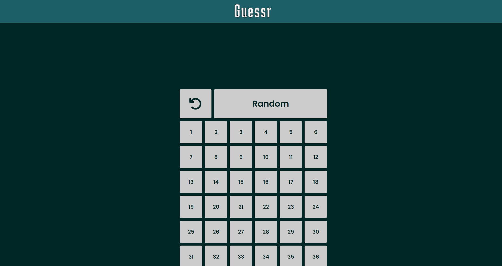
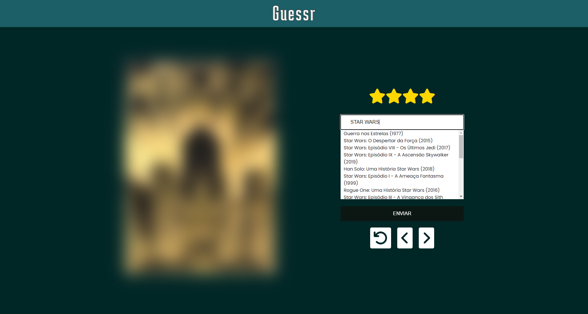
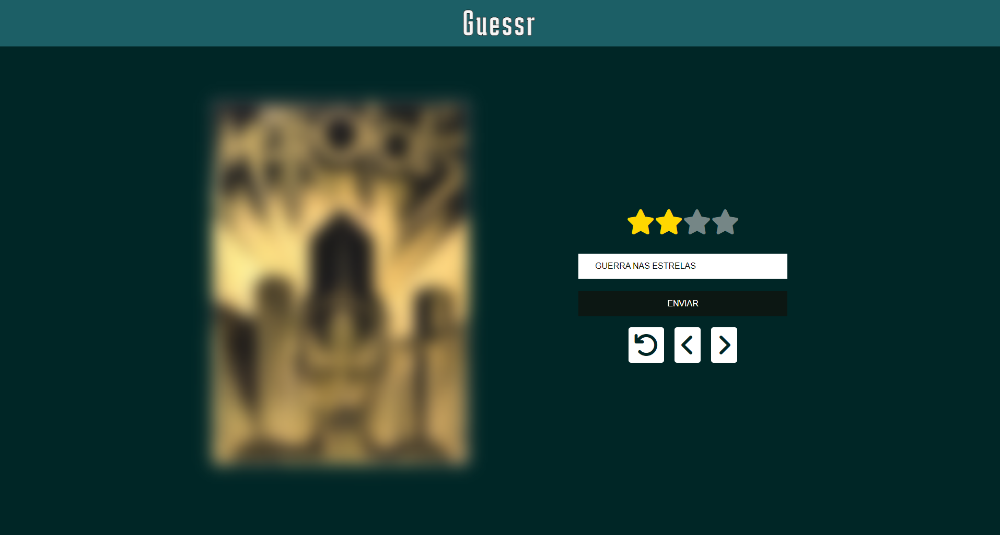
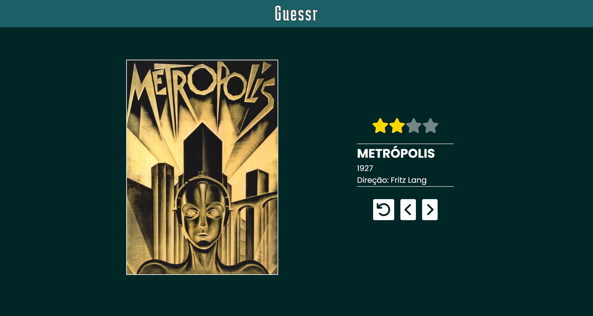

# Guessr - Web Game 🎥🎮🎧📚

Guessr é um jogo interativo que desafia os jogadores a adivinhar o álbum de uma música com base em pistas como a capa do álbum e outros detalhes. O projeto utiliza APIs externas como a do Deezer para buscar informações sobre os álbuns e músicas.

## 🚀 Funcionalidades
Adivinhe o filme, álbum, videogame ou quadrinho correto baseado na imagem da capa ou do pôster.
Pontuação baseada na rapidez e número de tentativas.

## 🛠️ Tecnologias Utilizadas
Angular - Framework front-end para construção de SPAs.
Typescript - Linguagem de programação usada com Angular.
TMDB, Deezer API, IGDB - APIs externas para buscar dados de áfilmes, álbuns e videogames.
CSS3 - Estilização visual do jogo.

## 🔧 Configuração e Instalação
### Pré-requisitos
Node.js (v12 ou superior)
Angular CLI (v13 ou superior)

### Passos para rodar o projeto localmente
Clone o repositório:
```bash
git clone https://github.com/seu-usuario/guessr-web-game.git
```

Acesse o diretório do projeto:
```bash
cd guessr-web-game/guessr
```

Instale as dependências:
```bash
npm install
```

Execute o projeto localmente:
```bash
ng serve
```
O projeto estará acessível em http://localhost:4200.

### Configuração das APIs
O projeto utiliza várias APIs externas, cada uma requer uma conta e credenciais próprias para o acesso. Siga os passos abaixo para configurar as APIs corretamente:

#### TMDB API:
Crie uma conta no TMDB.
Gere uma API Key.
No arquivo core/services/tmdb-api.service.ts, insira a API Key no local apropriado.

Para rodar o projeto localmente, no arquivo movie-api.service.ts:

Descomente a parte do código que está atualmente comentada, pois é a configuração para rodar localmente.
Comente a parte inferior do código que está descomentada, pois é a configuração utilizada para o Vercel.
Isso garante que a aplicação funcione corretamente em um ambiente local e de produção.

#### IGDB API (via Twitch):
Crie uma conta no Twitch.
Acesse o portal de desenvolvedores e gere um Client ID e um Client Secret.
No arquivo core/services/igdb-api.service.ts, insira o Client ID e o Token para acessar a API.

#### Deezer API:
Não é necessário criar uma conta, mas certifique-se de que o proxy para a API do Deezer está configurado corretamente no ambiente.

## 🎯 Como Jogar
Inicie o jogo clicando no botão "Start".


Escolha a fase desejada


Observe a imagem da capa do álbum exibida na tela.


Selecione o álbum correto entre as opções disponíveis.


A cada tentaiva errada, a imagem se torna um pouco mais nítida.


O desafio é acertar no menor número de tentaivas que puder.


## 🧑‍💻 Contribuindo
Se você tiver ideias para melhorias ou encontrar um bug, sinta-se à vontade para abrir uma issue ou enviar um pull request.
